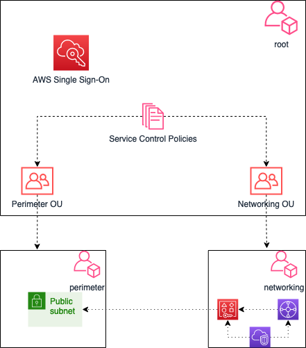

# Description of terraform-aws-secure-environment-accelerator solution
The AWS Secure Environment Accelerator is a tool designed to help deploy and operate secure multi-account, multi-region AWS environments on an ongoing basis. The power of the solution is the configuration file which enables the completely automated deployment of customizable architectures within AWS without changing a single line of code.
## Architecture

### The module create AWS organisation which consist of:
#### 1. Root account, which creates 9 OUs
- Operations
- Networking
- Security
- Perimeter
- Logging
- AI
- Backend
- Frontend
- Database
#### 2. 9 accounts inside OUs with same name as OUs
#### 3 Basic Networking setup
- 1 VPC in Networking account with 8 subnets
- 1 VPC with 8 subnets in Perimeter account with 8 subnets
- 2 Nat gateways for high availability in Perimeter account, which will be used by other accounts to access to internet.
- Transit gateway in Networking account, which shares attachment and/or VPCs will share subnets with other accounts using 
Resource Access management
#### 4. SSO enabled
#### 5. Service control policies, which will add guardrails to restrict the usage of services in the linked accounts

The configuration of the organization structure is performed through the variable `organization_structure`, which
has the type of map.
The Map consist of keys containing the accounts. 
Each account has organizational unit `ou` and `email` and is positioned inside the OU. 
The email is used for the billing details:
```hcl
# EXAMPLE with nested accounts inside Backend organisational unit, which has production, integration and uat
variable "organization_structure" {
  type = map(any)
  default = {
    networking = {
      email = "martin2754@gmail.com"
      ou    = "Networking"
    }
    security = {
      email = "martin2754@gmail.com"
      ou    = "Security"
    }
    logging = {
      email = "martin2754@gmail.com"
      ou    = "Logging"
    }
    perimeter = {
      email = "martin2754@gmail.com"
      ou    = "Perimeter"
    }
    operations = {
      email = "martin2754@gmail.com"
      ou    = "Operations"
    }
    backend = {
      email = "martin2754@gmail.com"
      ou    = "Backend"
    }

    backend-integration = {
      email = "martin2754@gmail.com"
      ou    = "Backend"
    }

    backend-uat = {
      email = "martin2754@gmail.com"
      ou    = "Backend"
    }

    backend-production = {
      email = "martin2754@gmail.com"
      ou    = "Backend"
    }

    frontend = {
      email = "martin2754@gmail.com"
      ou    = "Frontend"
    }
    database = {
      email = "martin2754@gmail.com"
      ou    = "Database"
    }
    ai = {
      email = "martin2754@gmail.com"
      ou    = "AI"
    }


  }

}
```
# Deployment
```bash
cd `terraform-aws-secure-environment-accelerator\landing_zone_builder`
terraform init && terraform apply --auto-approve
```
A Github Action was configured to perform terraform fmt check, terraform init and terraform plan

```yaml
name: 'Secure Environment Accelerator'

on:
  push:
    branches:
      - main
  pull_request:

jobs:
  terraform:
    name: 'Terraform Deploy'
    runs-on: ubuntu-latest
    environment: production

    # Use the Bash shell regardless whether the GitHub Actions runner is ubuntu-latest, macos-latest, or windows-latest
    defaults:
      run:
        shell: bash

    steps:
      # Checkout the repository to the GitHub Actions runner
      - name: Checkout
        uses: actions/checkout@v2

      - name: Configure AWS Credentials
        uses: aws-actions/configure-aws-credentials@v1
        with:
          aws-access-key-id: ${{ secrets.AWS_ACCESS_KEY_ID }}
          aws-secret-access-key: ${{ secrets.AWS_SECRET_ACCESS_KEY }}
          aws-region: ${{ secrets.REGION }}

      # Initialize a new or existing Terraform working directory by creating initial files, loading any remote state, downloading modules, etc.
      - name: Terraform Init
        run: terraform init

      # Checks that all Terraform configuration files adhere to a canonical format
      - name: Terraform Format
        run: terraform fmt -check
      # Terraform Security check for vulnerabilities and code smells
      - name: Terraform security scan
        uses: triat/terraform-security-scan@v3.0.0

        # Generates an execution plan for Terraform
      - name: Terraform Plan
        run: terraform plan
```
# Future work
1. Add centralised Logging(Cloudtrail, CW, Config aggregator, etc to Logging account)
2. Add centralised Security(Macie, Guard Duty, Security hub, IAM Access analyser, etc)
